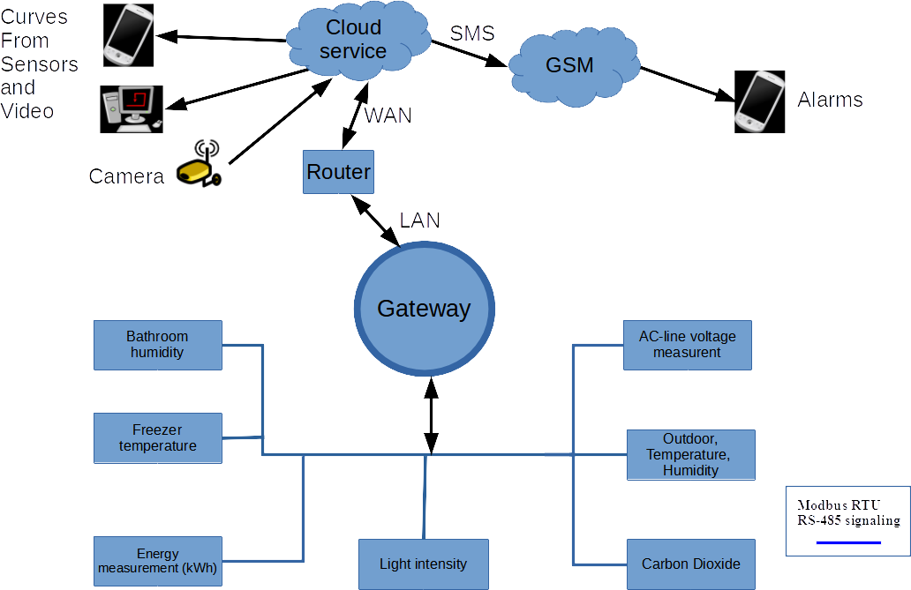
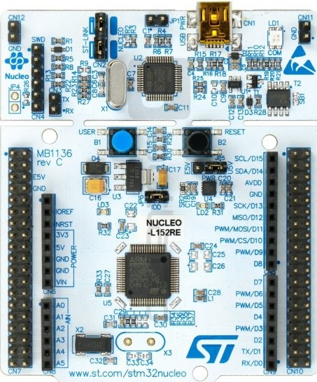
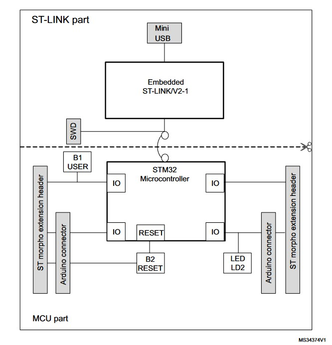
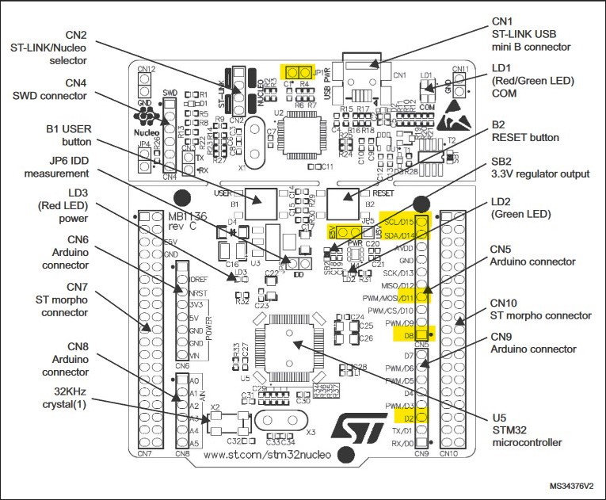
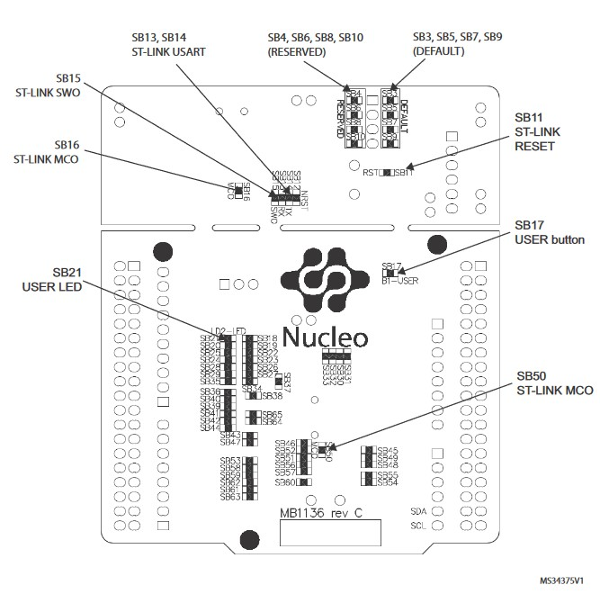

# stm32-nucleo152re-spg30-i2c-modbus-rtu-usart-rs485-iot-ticket

This is a project for the third-year course IITS2107-3004 Embedded Systems Design at Vaasa University of Applied Science 2023. This project is meant to get familiar with the full stack of IIOT(Industrial Internet of Things) development. 

# Objectives

* PCB Design and manufacturering
* Communication protocol I2C with SGP30 air quality sensor
* Communication protocol RS485
* Communication protocol MODBUS RTU
* Communication error handling - CRC, parity
* Wapice IoT-Ticket

 

# Equipment/Tools

* A PC with Windows 10 22H2 used, but GNU/Linux PC might be even better
* Atollic True Studio for STM32 9.3.0
* A STM32 Nucleo-l152re development board
* USB2.0 Type-A to Mini-B cable (for connecting and programming Nucleo board from PC)
* seeedstudio Grove SGP30 VOC and eCO2 Gas Sensor
* FTDI USB-RS485-WE-1800-BT usb to rs485 adapter cable
* MAX3485 RS-485 Transceiver
* Breadboard and connection wires
* 10k resisters x 2
* 100nF capacitor x 1

# Microcontroller

A microcontoller is a small/tiny computer on a single integrated circuit which contains processor, memory and inputs/outputs. It is used to control electronic devices and systems, ranging from simple appliances to complex machinery. For example digital clocks, coffee makers, cars, industrial robots, etc.
Microcontrollers are normally designed for a specific task or application, and are often used in embedded systems. They are often small in size and low in power consumption. They are ideal for battery-powered devices. 

## Processor

A (micro)processor aka CPU (Central Processing Unit) is a hardware component in a computer system. It is the center of a computer system. The key responsibility is to execute instructions and perform calculations, as well as coordinating the operation of other components in the system. 

* The architecturer varies as 8-bit, 16-bit, 32-bit and 64-bit. A CPU usually contains:
    * Arithmetic/Logic Unit (ALU), performs arithmetic and logic operations.
    * Control Unit, controls the flow of the data, follows fetch-execute cycle.
    * Registers, some very faster (but small) memory inside of a CPU. There are different types of registers:
        * **General-purpose (GP)** registers: These are the most common register and used for store some temperoty data.
        * **Special-purpose registers**: These registers are used for perform various special functions. For example:
            * **Access control registers (ACR)**: These registers are used to control the access of other registers.
            * **Status registers (SR)**: These registers indicates the status of other registers, such as Data Register ready or not.
            * **Interrupt registers**: These registers are used to manage and respond to interrupts. When an interrupt is generated, the microcontroller will typically save the current program state and jump to a specific interrupt service routine (ISR) that is associated with the interrupt. The ISR will then handle the interrupt and return control to the main program.
            Interrupt registers are used to manage the generation and handling of interrupts in the microcontroller. These registers typically include flags that indicate which interrupts have been generated, and may also include control bits that allow the microcontroller to enable or disable specific interrupts or interrupt sources. For example, in an STM32 microcontroller, the NVIC (Nested Vectored Interrupt Controller) is an interrupt register that manages the interrupt handling for the device. The NVIC includes a range of control registers, including the Interrupt Enable Register (IER), which is used to enable or disable specific interrupt sources, and the Interrupt Pending Register (IPR), which indicates which interrupts are currently pending.
            * **Program counter register (PCR)**: These
            * **Stack pointer register (SPR)**: This register stores the memory address of the top of the stack. The stack is used to store data during subroutine calls and interrupt service routines (ISR). And the SP register is automatically incremented and decremented as data is pushed and popped from the stack.
            * **Timer/counters (TIM/CNT)**: These registers are used for measuring time or counting events.
            * **Analog-to-digital converter (ADC)** registers: These registers are used for converting analog input signals to digital values.
            * **Digital-to-analog converter (DAC)** registers: These registers are used for converting digital values to analog signals.
            * **Communication interface registers**: USART/UART, I2C, SPI

    * Cache, some very faste (but not as fast as register) memory stores the data and instructions. There can be different levels of cache. For example L1, L2, L3 cache. 
* The frequency range from a few tens of kHz to a few hundred MHz.
* The memory range from as simple as little as a few kilobytes to many megabytes.
* The total number of IOs can range from a few to sevral dozens.

## Memory

Memories are used to store the data and program code. And there are different types of memories which vary in speed, volatility and cost:
* **Flash memory**: Flash memory is a type of non-volatile memory that is used to store the program code or firmware of the microcontroller. Flash memory is typically rewritable, which allows the firmware to be updated or changed over time. In STM32 microcontrollers, flash memory is often used to store the program code, and the size of the flash memory varies depending on the specific microcontroller model.

* **SRAM (Static Random Access Memory)**: SRAM is a type of volatile memory that is used to store data and variables during program execution. SRAM is typically faster than flash memory and can be read and written to quickly. However, SRAM requires a continuous power supply to retain its contents, which means that data stored in SRAM is lost when power is turned off or reset.

* **EEPROM (Electrically Erasable Programmable Read-Only Memory)**: EEPROM is a type of non-volatile memory that is used to store data that needs to be retained even when power is turned off or reset. EEPROM is typically slower than SRAM and flash memory, but it provides a convenient way to store small amounts of data that needs to be retained over time.

* **ROM (Read-Only Memory)**: ROM is a type of non-volatile memory that is used to store data that is not intended to be modified. In microcontrollers, ROM is often used to store fixed data such as lookup tables, calibration data, or bootloader code.

# STM32 - Nuleol152re

 

STM32 is a family of 32-bit microcontrollers by STMicroelectronics. These MCUs are based on the ARM Cortx-M processor architecture. The STM32 family includes a wide range of devices with varying features and capabilities, including different levels of performance, memory sizes, and peripherals. They are also available in different package types, including surface-mount and through-hole packages Some of the key features of the STM32 family include:

* High-performance 32-bit ARM Cortex-M processor core
* Integrated memory, including flash memory and RAM
* Rich set of peripherals, including timers, ADCs, DACs, communication interfaces: U(S)ART, I2C, SPI, USB...
* Low power consumption
* Support for real-time operating systems (RTOS), FreeRTOS, MicrimOS(uC/OS)...
* Wide range of development tools and software libraries to help simplify application development, such as STM32CubeIDE, STM32CubeMX, Arm Mbed, HAL, LL...

Nuleo-l152re is a development board designed on Ultra-low-power platform STM32L152RE MCU. And the key features and specs are:
* 1.65 V to 3.6 V power supply
* -40 °C to 105 °C temperature range
* 290 nA Standby mode (3 wakeup pins)
* 1.11 μA Standby mode + RTC
* 560 nA Stop mode (16 wakeup lines)
* 1.4 μA Stop mode + RTC
* 11 μA Low-power run mode down to 4.6 μA in Low-power sleep mode
* 195 μA/MHz Run mode
* 10 nA ultra-low I/O leakage
* 8 μs wakeup time
* Compatible with Arduino Uno V3 connection
* On-board debugger and programmer ST-LINK/V2-1
* Direct Memory Access (DMA)

